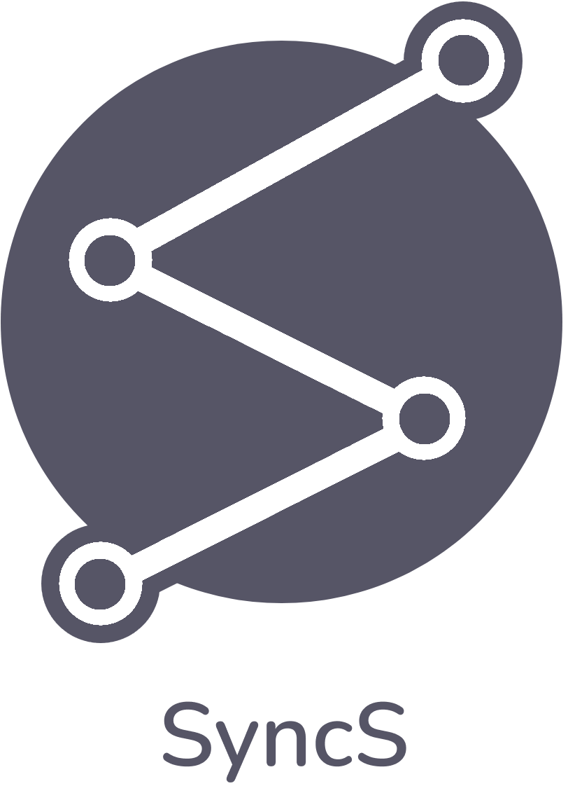
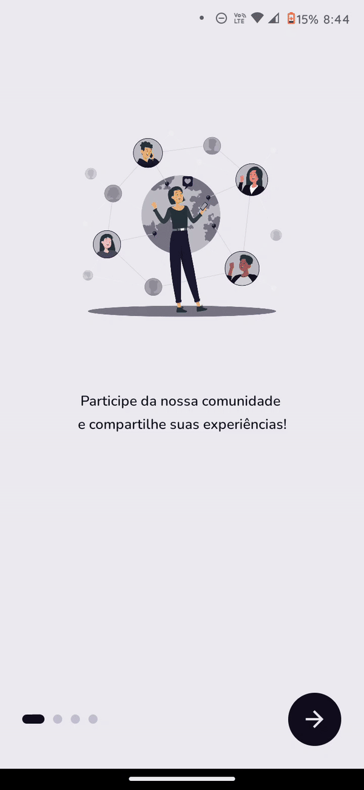

#### Trabalho de Conclusão de Curso
# Gamificando Experiências: Desenvolvimento de uma ferramenta para conectar e coletar insigths de egressos do Instituto Federal de Sergipe campus Lagarto

Um aplicativo móvel dedicado ao fortalecimento da conexão entre os egressos e o Instituto Federal de Sergipe, campus Lagarto. Proporcionando um espaço interativo para eles que compartilhem suas experiências, visões e opiniões sobre os desafios, conquistas e aprendizados ao longo de suas carreiras. Essas valiosas informações serão repassadas ao grupo competente do instituto, contribuindo assim para a tomada de decisões fundamentadas no aprimoramento curricular. Objetivando formar profissionais cada vez mais preparados para se destacarem no mercado de trabalho.

<p align="center">
  
</p>

&nbsp;
&nbsp;
&nbsp;
&nbsp;
&nbsp;

## Requisitos Funcionais

- [x]   Login dos usuários;
- [x]   Criação de conta;
- [x]   Recuperação de senha;
- [x]   Exibe módulos disponíveis;
- [x]   Resolução dos módulos;
- [x]   Avalia o desempenho dos usuários;
- [x]   Recompensa os usuários com conquistas desbloqueáveis e figuras colecionáveis;
- [x]   Fornece um esquema de níveis e pontos divididos em três categorias: Experiência, Profissionalismo e Sabedoria;
- [x]   Exibe timeline com eventos relevantes relacionados ao instituto;
- [x]   Exibe os níveis, as conquistas e as figuras coletadas;
- [x]   Exibe detalhes das conquistas;
- [x]   Permite zoom nas imagens;
- [x]   Permite encerramento da sessão do usuário;
- [x]   Permite a exclusão de conta;
- [x]   Permite a edição da conta do usuário;
- [x]   Permite alteração do tema do sistema entre Claro e Escuro;


## Protótipo FIGMA

O protótipo da aplicação pode ser visto nesse link: [SyncS - FIGMA](https://www.figma.com/file/neePuaoyD0FVMyRZGt26ha/TCC-2?type=design&node-id=0%3A1&mode=design&t=M1I7WmbQcRO1n36v-1)

<a href="https://www.figma.com/file/neePuaoyD0FVMyRZGt26ha/TCC-2?type=design&node-id=0%3A1&mode=design&t=M1I7WmbQcRO1n36v-1" target="_blank">
<p align="center">
  
</p>
</a>

## Variáveis de Ambiente

Para rodar esse projeto, você vai precisar adicionar as seguintes variáveis de ambiente no seu .env

```
EXPO_PUBLIC_FIREBASE_APIKEY=<YOUR_FIREBASE_APIKEY>
EXPO_PUBLIC_FIREBASE_AUTHDOMAIN=<YOUR_FIREBASE_AUTHDOMAIN>
EXPO_PUBLIC_FIREBASE_PROJECTID=<YOUR_FIREBASE_PROJECTID>
EXPO_PUBLIC_FIREBASE_STORAGEBUCKET=<YOUR_FIREBASE_STORAGEBUCKET>
EXPO_PUBLIC_FIREBASE_MESSAGINGSENDERID=<YOUR_FIREBASE_MESSAGINGSENDERID>
EXPO_PUBLIC_FIREBASE_APPID=<YOUR_FIREBASE_APPID>
EXPO_PUBLIC_FIREBASE_MEASUREMENTID=<YOUR_FIREBASE_MEASUREMENTID>
```

## Pré-requisitos

 - Ter o [Firebase](https://firebase.google.com/?hl=pt-br) configurado.
 - Ter o [Expo Go](https://expo.dev/expo-go) instalado.
 - Ter o [NodeJS](https://nodejs.org/) instalado.

## Instalação

Para instalar, execute o seguinte comando na pasta do projeto:

```js
    npm install
```

## Executando o projeto

Para rodar o projeto execute o seguinte comando na pasta do projeto:

```js
    npx expo start
```

Basta lê o QrCode gerado atraves do aplicativo do Expo Go instalado em seu smartphone.
## Resultados




